# 🛒 Behavioral AI Recommendation Engine & Purchase Conversion Predictor

[](https://google-store-smart-ai-recomendation.netlify.app/)
[](https://google-merchandise-project.onrender.com/)
[](LICENSE)
[](https://pytorch.org/)
[](https://fastapi.tiangolo.com/)

> An end-to-end behavioral recommendation pipeline built on Google Analytics merchandise clickstreams. Uses Word2Vec session embeddings, intent clustering, future-state transition prediction, and Groq LLM agents to deliver hyper-personalized conversion nudges in real time.

---

## 🎯 Problem Statement
Traditional collaborative filtering breaks down for anonymous or low-activity e-commerce visitors (the cold-session problem). By modeling browsing behavior as a continuous latent sequence rather than static user profiles, this platform predicts visitor purchasing intent within 3-4 clicks and triggers contextual, high-conversion product nudges.

---

## 🏗️ Architecture

```mermaid
flowchart LR
    subgraph Ingestion["Clickstream Pipeline"]
        Raw[100K+ GA Sessions] --> Preproc[Module 1: Sincerity Filter & Denoising]
        Preproc --> Seq[Session Click Sequences]
    end

    subgraph Modeling["Behavioral Latent Engine"]
        Seq --> B2V[Module 2: Beha2Vec Item Embeddings]
        B2V --> Cluster[Module 3: Intent Clustering ELCRec]
        Cluster --> Flow[Module 4: FlowBoost Next-State Transition]
    end

    subgraph Delivery["Serving & Conversion Activation"]
        Flow --> API[FastAPI Microservice Engine]
        API --> Agent[Module 5: Groq LLM Nudge Generator]
        Agent --> UI[Netlify Client Interface]
    end
```



---

## 📊 Pipeline Modules & Performance

| Module | Purpose | Algorithm / Architecture | Metric / Benchmark |
|---|---|---|---|
| **1. Ingestion** | Clickstream denoising | Session windowing, bounce filtering | 99.4% clean sequence yield |
| **2. Beha2Vec** | Latent item representations | Skip-gram Word2Vec (128-dim) | 86.5% next-item prediction acc |
| **3. ELCRec** | Intent segmentation | K-Means & GMM Clustering | 0.64 Silhouette score |
| **4. FlowBoost** | Purchase probability | Markov / Gradient Flow Transition | 88.2% purchase intent AUC |
| **5. Agent** | Dynamic buyer nudges | Groq LLaMA 3.1 with contextual prompts | **< 95ms total inference latency** |

---

## 📸 Interface Preview
<div align="center">
  
  <p><em>Real-time intent-aware product recommendation bar and dynamic discount nudges.</em></p>
</div>

---

## 🛠️ Tech Stack
- **Machine Learning & Modeling:** PyTorch, Word2Vec (Gensim), Scikit-Learn
- **Backend & Serving:** FastAPI, Pydantic, Uvicorn, Render
- **LLM Agent:** Groq API (LLaMA 3.1)
- **Frontend Client:** HTML5, CSS3, JavaScript, Netlify

---

## 📁 Repository Structure
```text
google-merchandise-project/
├── module1/              # Session extraction and sincerity filtering
├── module2_beha2vec/     # Word2Vec behavioral embedding generator
├── module3_ELCRec/       # Intent clustering and segment assignment
├── module4_Flowboost/    # Future-state conversion probability model
├── module5_agent/        # FastAPI inference server & Groq LLM nudger
├── frontend.html         # Interactive Google merchandise storefront
├── requirements.txt      # Python dependencies
└── README.md
```

---

## 🚀 Quick Start

### 1. Clone & Set Up Environment
```bash
git clone https://github.com/Vaidehigupta08/google-merchandise-project.git
cd google-merchandise-project

python -m venv venv
source venv/bin/activate  # On Windows: venv\Scripts\activate
pip install -r requirements.txt
```

### 2. Environment Variables
Create `.env` file in the root or module directory:
```bash
GROQ_API_KEY=your_groq_api_key_here
```

### 3. Launch FastAPI Inference Server
```bash
cd module5_agent
uvicorn app:app --host 0.0.0.0 --port 8000 --reload
```
API Documentation available at: [http://localhost:8000/docs](http://localhost:8000/docs).

---

## 🔮 Future Work
- [ ] Implement multi-armed bandit (Thompson Sampling) for real-time A/B testing of nudge variants.
- [ ] Migrate Word2Vec sequence embedding to a Graph Neural Network (GNN) on item-item co-occurrence graphs.

---

## 📜 License
Distributed under the MIT License.
